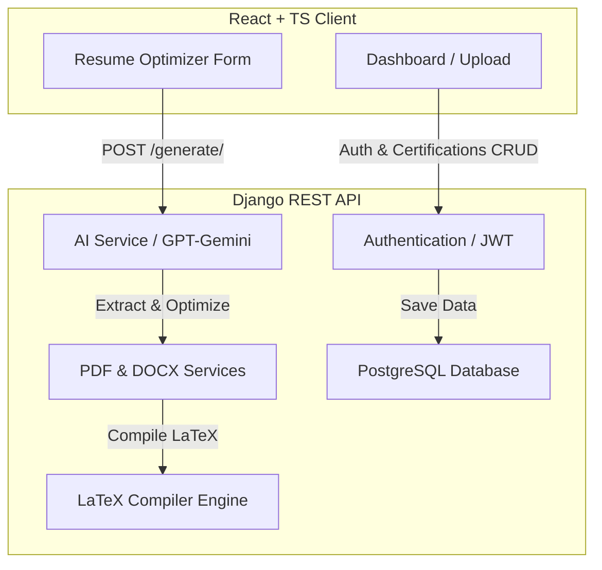

# 📄 ResumeMaker

ResumeMaker is a full-stack, AI-powered **ATS Resume Optimizer & Application Assistant**. It compiles LaTeX and plain-text resumes tailored to specific job descriptions, generates structured cover letters (PDF/DOCX), drafts custom application emails, and calculates an ATS alignment score using token-level diff visualization.

---

## ✨ Features

*   **LaTeX-First Exact Structure Mode:** Tailors your resume's **Summary**, **Headline**, and **Skills** sections while preserving the formatting and content of your **Experience**, **Projects**, and **Education** sections.
*   **Template Injection:** Supports dynamic rendering of LaTeX placeholders (`{{HEADLINE}}`, `{{SUMMARY}}`, `{{SKILLS}}`) on base templates.
*   **Automated Document Generation:**
    *   **Tailored Resume:** Optimized LaTeX source code and compiled PDF.
    *   **Cover Letter:** Fixed-structure professional cover letter exported as PDF and editable Word DOCX.
    *   **Application Email:** Context-specific email subject and body (tailored for technical and non-technical roles).
*   **ATS Alignment Analytics:** Extracted keywords, matching percentages, missing terminology, and token-level diff highlighting.

---

## 🛠️ Technology Stack

| Component | Technologies |
| :--- | :--- |
| **Backend** | Python 3.10+, Django 4.2, Django REST Framework, Simple JWT, PostgreSQL, Celery, Redis |
| **Frontend** | React 18, TypeScript, Vite, Tailwind CSS, Framer Motion |
| **AI Orchestration** | OpenAI SDK (fully compatible with Google Gemini / Groq base endpoints) |
| **Document Engines** | `pypdf`, `python-docx`, `reportlab`, LaTeX compilers (`tectonic` / `xelatex` / `pdflatex`) |

---

## 📐 System Architecture

The following diagram illustrates the relationship between the React frontend client, the Django REST backend, the AI generation service, and the supporting compilers and database:



---

## 📂 Project Structure

```text
.
├── backend/                   # Django REST Framework backend
│   ├── accounts/              # Custom User model & auth logic
│   ├── api/                   # Resume parsing, optimization pipeline, & views
│   ├── certifications/        # Certification CRUD endpoints
│   ├── config/                # Django project settings and URLs
│   ├── profiles/              # Candidate profile information
│   ├── templates/             # LaTeX resume template assets
│   ├── manage.py
│   └── requirements.txt
├── frontend/                  # React + TypeScript + Vite frontend
│   ├── src/
│   │   ├── components/        # Reusable UI components (Sidebar, AppHeader, FileUpload, etc.)
│   │   ├── pages/             # Page views (Dashboard, Resume Optimizer, Profile, Certifications, etc.)
│   │   ├── services/          # API services (Axios client config)
│   │   └── App.tsx            # App routing
│   ├── index.html
│   ├── package.json
│   └── tailwind.config.js
└── pyrefly.toml               # Pyrefly linter configuration
```

---

## 🖥️ Project Views (Frontend Pages)

The frontend application exposes the following user-facing routes and views:

*   `/` — **Landing Page**: Public homepage introducing features.
*   `/login` — **Authentication**: User registration and login forms.
*   `/forgot-password` — **Forgot Password**: Password reset email validation.
*   `/reset-password` — **Reset Password**: Form to enter new password.
*   `/dashboard` — **Dashboard**: Upload LaTeX base resumes and manage active items.
*   `/resume-optimizer` — **Resume Optimizer**: Form to insert target job details and run the optimization engine.
*   `/profile-view` — **Profile Manager**: Edit full name, contact details, links, summary, and skills list.
*   `/certifications` — **Certifications CRUD**: Manage licenses, issuers, dates, and media.

---

## 🚀 Quick Start & Local Setup

### Prerequisites
*   Python 3.10+ & `pip`
*   Node.js 18+ & `npm`
*   PostgreSQL running database
*   OpenAI-compatible API key (e.g. Gemini, Groq, or OpenAI)
*   A LaTeX compiler installed on your system (e.g., Tectonic or XeLaTeX)

---

### 1. Backend Setup

Navigate to the `backend` directory, initialize the environment, and run database migrations:

```bash
# Navigate to backend
cd backend

# Create virtual environment
python -m venv venv

# Activate virtual environment
# On Windows (PowerShell):
venv\Scripts\Activate.ps1
# On Windows (CMD):
venv\Scripts\activate
# On macOS/Linux:
source venv/bin/activate

# Install dependencies
pip install -r requirements.txt

# Create environment configuration
copy .env.example .env  # On Windows
cp .env.example .env    # On macOS/Linux

# Apply migrations
python manage.py migrate

# Create admin superuser
python manage.py createsuperuser

# Start development server
python manage.py runserver
```

> [!TIP]
> If running backend commands without activating the virtual environment in your terminal, use explicit paths:
> *   **Windows:** `venv\Scripts\python.exe manage.py <command>`
> *   **macOS/Linux:** `venv/bin/python manage.py <command>`

Backend runs locally at: `http://localhost:8000`

---

### 2. Frontend Setup

In a new terminal window, navigate to the `frontend` directory, install node modules, and start the development server:

```bash
# Navigate to frontend
cd frontend

# Install packages
npm install

# Start Vite server
npm run dev
```

Frontend runs locally at: `http://localhost:5173`

---

## 🔑 Environment Variables

### Backend (`backend/.env`)

| Key | Required | Description / Example |
| :--- | :---: | :--- |
| `SECRET_KEY` | Yes | Django secret key for session/token signing. |
| `DEBUG` | No | `True` for development, `False` for production. |
| `DB_NAME` | Yes | Name of PostgreSQL database (e.g. `resumemaker_db`). |
| `DB_USER` | Yes | PostgreSQL username (e.g. `resumemaker_db_user`). |
| `DB_PASSWORD` | Yes | PostgreSQL password. |
| `DB_HOST` | Yes | Local `localhost` or Render host (e.g. `*.oregon-postgres.render.com`). |
| `DB_PORT` | Yes | Database port (typically `5432`). |
| `OPENAI_API_KEY` | Yes | Your API key for the AI model. |
| `OPENAI_BASE_URL` | Yes | OpenAI compatible endpoint url (e.g., Gemini's OpenAI base url). |
| `AI_MODEL` | Yes | Target model name (e.g. `gemini-2.0-flash`). |
| `CORS_ALLOWED_ORIGINS`| Yes | Allowed origins (e.g., `http://localhost:5173`). |
| `LATEX_STRICT_MODE` | No | Set `True` to disable text PDF fallbacks if compile fails. |

### Frontend (`frontend/.env`)
*   `VITE_API_BASE_URL=http://localhost:8000`

---

## 📡 API Endpoint Reference

### Authentication
*   `POST /api/auth/register/` — Register a new account.
*   `POST /api/token/` — Log in and obtain JWT.
*   `POST /api/token/refresh/` — Refresh access token.
*   `POST /api/auth/password/forgot/` — Request password reset.
*   `POST /api/auth/password/reset/` — Confirm password reset.

### Profiles & Certifications
*   `GET /api/profile/me/` — Retrieve user profile.
*   `PUT/PATCH /api/profile/update_me/` — Edit profile details.
*   `GET/POST/PUT/DELETE /api/certifications/` — CRUD user certifications.

### Resumes & Generation
*   `GET/POST/DELETE /api/resumes/` — CRUD uploaded resumes (Upload `.tex` for optimization).
*   `POST /api/resume-optimizer/generate/` — Generate customized resume, cover letter, and application email payload.
*   `GET /api/jobs/` — View generation job history.
*   `GET /api/generated-documents/` — Retrieve previously generated document configurations.


